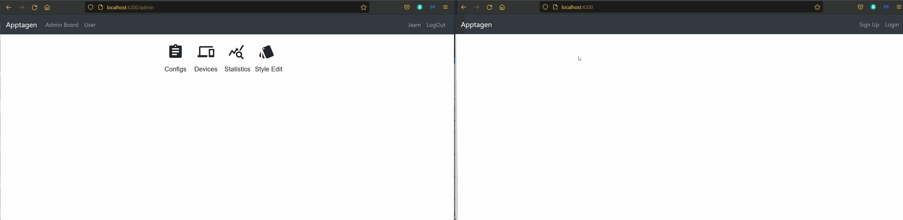
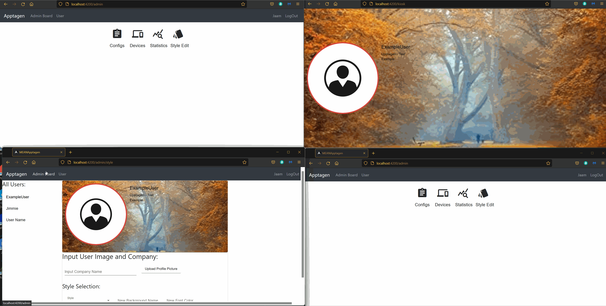
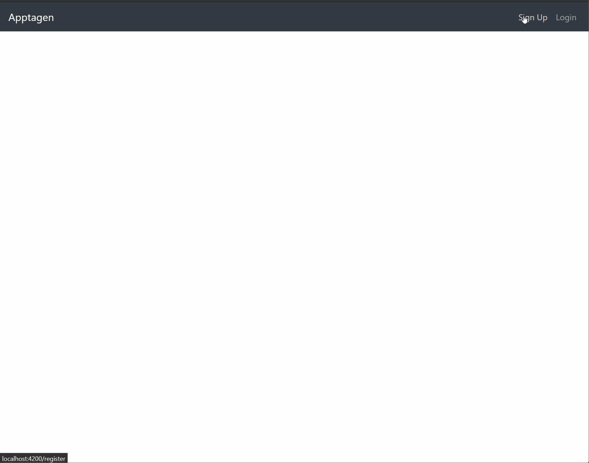
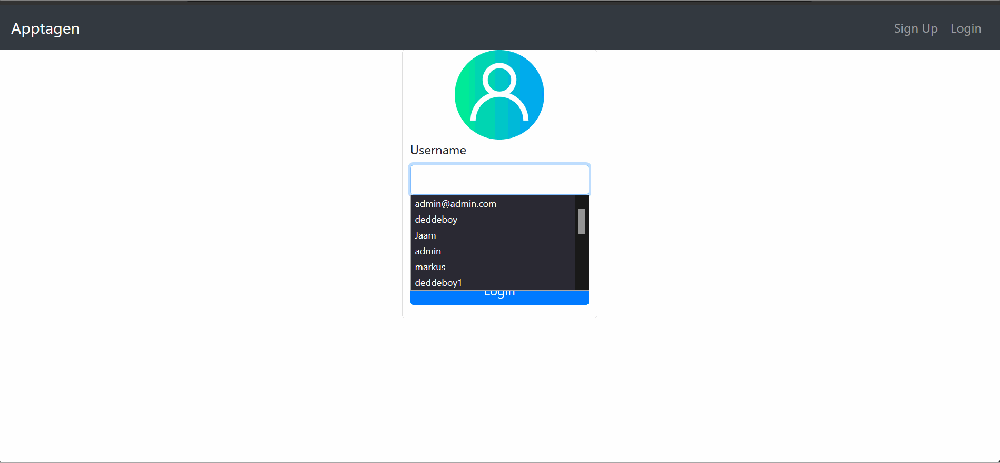
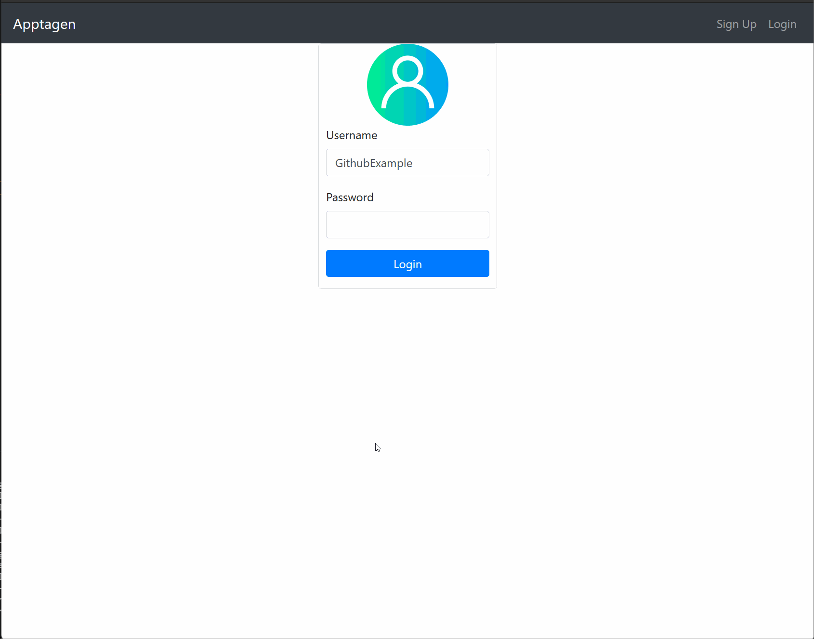

# MEANApptagen

This project was generated with [Angular CLI](https://github.com/angular/angular-cli) version 13.1.2.

## Table of Content
[Introduction](#introduction)

[Kiosk/End Point View](#kioskend-point-view)

[Admin Functions](#admin-functions)
- [Editing Configurations](#editing-configurations)

- [Editing Devices](#editing-devices)

- [Editing Styles](#editing-styles)

[Getting Statistics](#getting-statistics)

[Sign-up/Sign-in](#sign-upsign-in)

[User Functionality](#user-functionality)
    
<!-- * [License](#license) -->
    
## Introduction
The Apptagen-project is about present individuals at a physical location in a digital format, allowing for a user to specify what their current availability is to anyone trying to reach them on-site.
e.g If you're in an office building that recieves people or you're working at a large company. You can log into the apptagen website, set your own status as "Busy, Away, Vacation or Available" and a Custom message, specifying what you're doing.
To inform anyone near your office or any location where it might be relevant to show a user about what your current availability is, such as where your office is in an office building. Or at the classical "Office Floor"-list over what company is on that level or who is on that floor.
## Kiosk/End Point View

The Kiosk view is intended to be the end point, where we present a summary of all users who's information we want to present on the display. Its not intended to be a point where any data is edited, only updating and presenting data recieved in real time.
## Admin Functions

The admininstrator has multiple functionalities, the currently implemented ones are Configuration, Device and Style view. Statistics is still in development. All of these functionalities update End points in real time.

### Editing Configurations
A administrator will most likely be spending time adjusting configurations the majority of the time they're using the admin controls.
Such as creating a config:

and editing an existing config:

Configurations that are created only exist locally until they're uploaded to the database though the "Update" function. Until then they can't be deleted because they're only temporary for the current session, refreshing the page will delete all temporary ones. 

Editing a configuration allows you to assign new users and remove users to an existing configuration, these changes are then passed to all devices assigned this config in real-time.

### Editing Devices
There are multiple ways to edit a device, one of the ways you can adjust your devices, one of them being to swap between configurations, updating said device in real-time.

or removing a device's configuration:

Adjusting devices in real time doesnt happen until the "update device" call happens when the admin clicks the button, informing the backend to update all affected devices.

### Editing Styles
Presenting your organization is an important aspect of day-to-day operations, as such, here's how you can edit and adapt your individual employees profile-card, that will be presented on your End points.

Uploading a Background to allow for your company or device to have various styles depending on a person's department, position or company.

When you're on-site and looking for a certain individual, knowing what they look like is important, so we've offered to have these people upload a profile picture so that you can see what they look like when you're trying to see if they're available.

As you would expect, if you're looking to update a style/background to your end points, in this example, the font color. You wouldn't want to do this update to each card. So when you've selected a style, input a font color and then updated the card.
All person-cards using that style will then recieve the update and update accordingly on each end point containing that style.

### Getting Statistics
Getting statistics and logging other database changes is currently not implemented in Apptagen V 0.1

## Sign-up/Sign-in
Signing up and logging in is as easy as follows, also presenting you with a user's access privileges. This is intended to be the users way of editing their status and other person-related functionalities.

## User Functionality
Here is what the User's controls look like, showcasing them being able to update their status/availability and add a message to be presented to all end points with that user in it.

## Setting the Project up
This is a MEAN-stack project but other dependencies include:
    
    - PrimeNG's Carousel
    - Live-server
    - Multer filehandling
    - Socket.Io
    - Prime icons
    - uuid v4
    - ws
    - jsonwebtoken

The >start_webserver.sh script runs the deployment for setting up the frontend to be accessible publicly, atleast on the LAN, implementation has not been tested on a web server with a public IP.
Then you'll need to run the backend by calling "node server.js"
